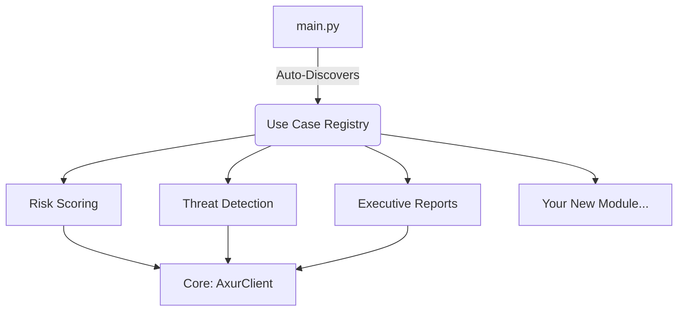

<div align="center">

# Axur Partner Enablement Kit
### Enterprise Risk Assessment Toolkit v4.0

[]()
[]()
[]()
[](https://docs.axur.com)

*Turn raw threat intelligence into executive business value.*

[🇪🇸 Español](README.es.md) | [🇧🇷 Português](README.pt.md) | [🇬🇧 English](README.md)

</div>

---

## 🚀 Overview

This toolkit provides a **reference architecture** for Axur Partners to build high-value services on top of the Axur Platform. Stop selling just "alerts" and start selling **Strategic Risk Management**.

### Why use this kit?

| Business Problem | The Solution (Included) |
|:---|:---|
| *"How secure am I right now?"* | **Risk Score v3.1** (0-1000 Executive Score - Per Brand) |
| *"How is each subsidiary doing?"* | **Risk Score v4.0** (Per-Brand Analysis) |
| *"What should I fix first?"* | **DREAD Analysis** (Prioritized queue) |
| *"Who is attacking me?"* | **STRIDE Matrix** (Threat classification) |
| *"Is my website protected?"* | **OnePixel Filter** (Origin verification) |

---

## ⚡ Quick Start

### 1. Choose Your Adventure

| I want to... | Go to... |
|:---|:---|
| **Learn the Basics** | [`/examples`](examples/) - Simple "Hello World" scripts |
| **Run Per-Brand Analysis** | Run `python examples/02_risk_score_per_brand.py` |
| **Run a Demo** | Run `python main.py` for the interactive menu |
| **Build an App** | Use the [`/core`](core/) and [`/use_cases`](use_cases/) modules |
| **Understand the Math** | Read [`/docs/RISK_METHODOLOGY.md`](docs/RISK_METHODOLOGY.md) |

### 2. Run the Toolkit

```bash
# 1. Clone repo
git clone https://github.com/maisonnat/ax-ejemplo.git

# 2. Install dependencies
pip install -r requirements.txt

# 3. Configure API Key
# Rename config.example.json to config.json and add your key

# 4. Launch
python main.py
```

---

## 🏗️ Architecture (The Library Model)

This project uses a **Plug-and-Play "Library" Architecture**. New use cases can be dropped into the `/use_cases` folder and are automatically discovered by the system.



---

## 📚 Documentation

- **[API Reference & Mocks](docs/API_REFERENCE.md)**: Details on endpoints and simulated responses.
- **[Risk Score Methodology](docs/RISK_METHODOLOGY.md)**: How the 0-1000 score is calculated.
- **[Threat Models](docs/THREAT_MODELS.md)**: Deep dive into DREAD and STRIDE.

---

## 🤝 Contributing

We welcome contributions from the Axur Partner Community! 

1. Create a folder in `/use_cases/your_feature`
2. Implement the `UseCase` interface
3. Submit a Pull Request

---

*Built with ❤️ for the Axur Partner Ecosystem*
