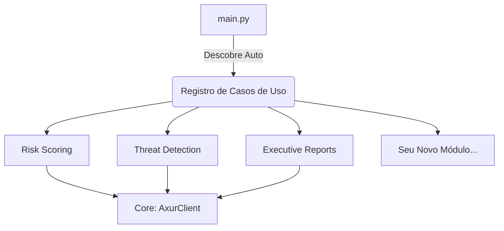

<div align="center">

# Axur Partner Enablement Kit
### Enterprise Risk Assessment Toolkit v4.0

[]()
[]()
[]()
[](https://docs.axur.com)

*Transforme inteligência de ameaças em valor executivo de negócio.*

[🇪🇸 Español](README.es.md) | [🇧🇷 Português](README.pt.md) | [🇬🇧 English](README.md)

</div>

---

## 🚀 Visão Geral

Este toolkit fornece uma **arquitetura de referência** para Parceiros Axur construírem serviços de alto valor em cima da Plataforma Axur. Pare de vender apenas "alertas" e comece a vender **Gestão Estratégica de Risco**.

### Por que usar este kit?

| Problema de Negócio | A Solução (Inclusa) |
|:---|:---|
| *"Quão seguro estou agora?"* | **Risk Score v3.0** (Score Executivo 0-1000) |
| *"O que devo corrigir primeiro?"* | **Análise DREAD** (Fila priorizada) |
| *"Quem está me atacando?"* | **Matriz STRIDE** (Classificação de ameaças) |
| *"Meu site está protegido?"* | **Filtro OnePixel** (Verificação de origem) |

---

## ⚡ Início Rápido

### 1. Escolha sua Aventura

| Eu quero... | Vá para... |
|:---|:---|
| **Aprender o Básico** | [`/examples`](examples/) - Scripts simples "Hello World" |
| **Rodar uma Demo** | Execute `python main.py` para o menu interativo |
| **Construir um App** | Use os módulos [`/core`](core/) e [`/use_cases`](use_cases/) |
| **Entender a Matemática** | Leia [`/docs/RISK_METHODOLOGY.md`](docs/RISK_METHODOLOGY.md) |

### 2. Execute o Toolkit

```bash
# 1. Clone o repo
git clone https://github.com/maisonnat/ax-ejemplo.git

# 2. Instale dependências
pip install -r requirements.txt

# 3. Configure API Key
# Renomeie config.example.json para config.json e adicione sua chave

# 4. Inicie
python main.py
```

---

## 🏗️ Arquitetura (Modelo Biblioteca)

Este projeto usa uma **Arquitetura "Biblioteca" Plug-and-Play**. Novos casos de uso podem ser soltos na pasta `/use_cases` e são descobertos automaticamente pelo sistema.



---

## 📚 Documentação

- **[Referência da API & Mocks](docs/API_REFERENCE.md)**: Detalhes sobre endpoints e respostas simuladas.
- **[Metodologia Risk Score](docs/RISK_METHODOLOGY.md)**: Como o score 0-1000 é calculado.
- **[Modelos de Ameaça](docs/THREAT_MODELS.md)**: Mergulho profundo em DREAD e STRIDE.

---

## 🤝 Contribuindo

Aceitamos contribuições da Comunidade de Parceiros Axur!

1. Crie uma pasta em `/use_cases/sua_feature`
2. Implemente a interface `UseCase`
3. Submeta um Pull Request

---

*Construído com ❤️ para o Ecossistema de Parceiros Axur*
